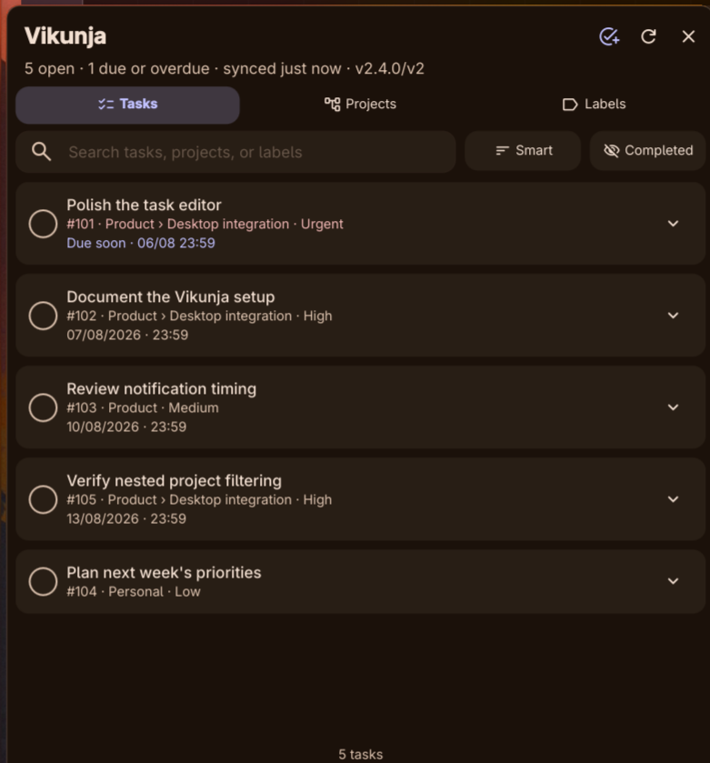

# dms-vikunja

`dms-vikunja` is a DankMaterialShell composite plugin for managing Vikunja from DankBar. A single background daemon synchronizes the account and sends due-date notifications; the widget exposes task and project operations without opening the full web application.



## Features

- Open-task count and due/overdue state in horizontal and vertical DankBars.
- Accessible urgency state in the bar and task rows: icon, wording, border, and color agree.
- One-click task views for all, today/overdue, favorites, and the active project.
- One shared daemon, so multiple bars do not poll Vikunja independently.
- Nested project paths and project filtering that includes descendants.
- Searchable hierarchical project picker that gives the project name priority and shows its parent path separately.
- Project inclusion controls: uncheck a parent to exclude its complete subtree.
- Cross-project label view with live task counts.
- Local search across task titles, descriptions, identifiers, projects, and labels.
- Sorting by smart order, due date, priority, title, project, or last update.
- Optional completed-task view and one-click complete/reopen actions.
- Quick task creation with project, due date, priority, and labels.
- Task editing for title, multiline content, native status/progress, due date,
  priority, project, and labels.
- Dropdown due-date calendar with Today, Tomorrow, This weekend, Next week, and no-date shortcuts while preserving an existing task time.
- Readable previews for HTML task descriptions; untouched source markup is preserved when saving other fields.
- Multiline content editor with safe HTML escaping and automatic clickable http(s) links.
- Multi-file attachment picker with indeterminate upload progress, per-file partial-error reporting, and attachment name/type/size listing; deletion remains in Vikunja.
- Searchable label selector for accounts with long label lists.
- Explicit, two-step task deletion and a shortcut to open the task in Vikunja.
- Deduplicated desktop notifications for tasks entering the due-soon window or becoming overdue.
- Optional launcher quick add: type `vt` followed by a title to create a task in the configured default project.
- Persistent cache for a useful read-only view during transient network failures.
- Automatic API selection: v1 for Vikunja 2.3 and earlier, v2 for Vikunja 2.4 and later.

## Requirements

- DankMaterialShell 1.5.0 or newer.
- Python 3.
- `secret-tool` from libsecret and an unlocked Secret Service keyring.
- `notify-send` from libnotify.
- A Vikunja API token with:
  - read access to projects, tasks, and labels;
  - write access to tasks and task labels.
  - read and write access to task attachments when using the attachment picker.

The token is stored under service `dms-vikunja`, key `api-token`, in Freedesktop Secret Service. It is never written to `plugin_settings.json` or this repository.

## Installation

Clone the repository and run:

```bash
./Support/setup-symlink.sh
dms ipc call plugin-scan scan
dms ipc call plugins enable dmsVikunja
```

Then add `dmsVikunja` to a DankBar section in **Settings → DankBar → Widgets**.

For development, DMS can rescan and reload the installed symlink:

```bash
dms ipc call plugin-scan rescan dmsVikunja
dms ipc call plugins reload dmsVikunja
```

## Configuration

Open **Settings → Plugins → dms-vikunja**:

1. Enter the Vikunja base URL, without `/api`.
2. Keep **API version** on **Auto** unless diagnosing a server issue.
3. Paste and save the API token. The field is cleared after Secret Service accepts it.
4. Run **Test connection**.
5. Choose synchronization, sorting, completed-task, and notification preferences.
6. After the first successful sync, select a default quick-add project.

Project exclusions live in the widget's **Projects** tab, where the hierarchy and task counts provide enough context to make the choice.

## Notification behavior

The first successful synchronization is deliberately silent, so installing the plugin does not emit a notification storm for an existing backlog. Later syncs notify once per task, due date, and state:

- **due soon** when the task first enters the configured lead window;
- **overdue** when it crosses its due date while DMS is running.

Changing a due date starts a new notification cycle. Completed tasks and excluded projects do not notify.

## API compatibility

The adapter first reads the public `/api/v1/info` endpoint and selects the matching contract:

- Vikunja `< 2.4.0`: v1 list responses and legacy create/update verbs.
- Vikunja `>= 2.4.0`: v2 pagination envelopes, standard REST verbs, and merge-patch task updates.

The implementation follows Vikunja's [API documentation](https://vikunja.io/docs/api-documentation/) and [API v2 migration contract](https://vikunja.io/docs/api-v2/).

## Current scope

Version 0.2.0 adds accessible urgency states, saved task-view presets, and the optional `vt` launcher quick-add surface while retaining the task fields and non-destructive attachment workflow needed for a fast bar experience. Attachment deletion, project creation/deletion, comments, assignees, relations, recurring-task rules, and Kanban bucket moves remain in the full Vikunja interface.

Due dates accept `YYYY-MM-DD` or `YYYY-MM-DD HH:mm` in the local timezone. A date without a time defaults to 23:59.

## Development and tests

The test suite uses local mock v1 and v2 servers; it never needs a real Vikunja token or task account.

```bash
python3 -m unittest -v tests/test_api.py
node tests/test-vikunja.js
qmllint -I /path/to/DankMaterialShell/quickshell \
  StartupCheck.qml VikunjaDaemon.qml AttachmentPanel.qml ContentEditor.qml DueDatePicker.qml ProjectPicker.qml TaskRow.qml VikunjaWidget.qml Settings.qml
```

## License

MIT
